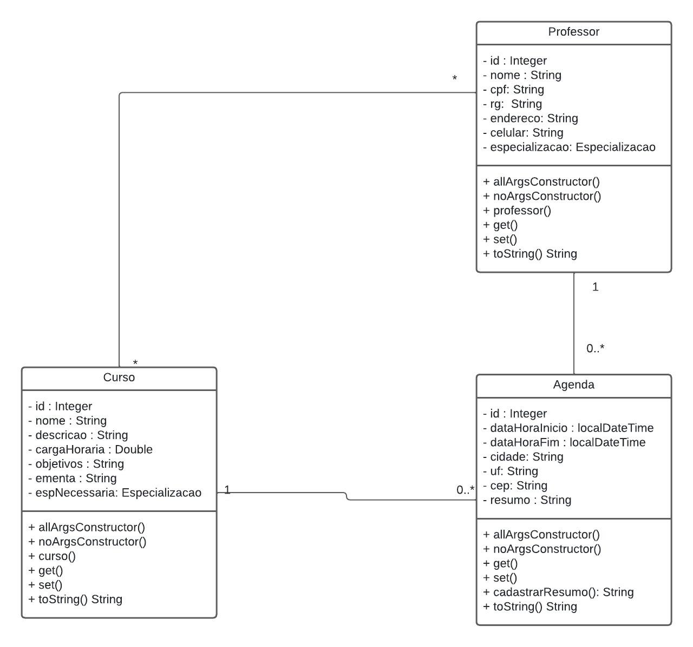

# AC2 ARQUITETURA WEB atividade 4
</a>
</a>

## Grupo
**211929** José Marcos Rezende Júnior
 
**211024** Luiz Minozi
 
**211908** Rafael Modena Jakubovsky
 
**211559** Vinicius Kalach

## Descrição
O projeto foi desenvolvido na IDE IntelliJ, consiste em um código para colocar em prova o conhecimento em arquitetura web, criando um gerenciador de agenda para professores.

## Apresentação (211908)
https://youtu.be/Zd--QRXGD8Y

## Diagrama de classe

## Requisitos
#### A entrega deverá ser um documento com:
- O diagrama de classes (pode ser somente das classes que serão entidades)
- O código fonte de cada classe, repositório, serviço e controller.
- Link do Github com o projeto completo.

#### Pontuação:
1. (1,0) Defina o diagrama de classe
2. (1,0) Crie as classes de entidade com JPA
3. (1,0) Implemente os relacionamentos entre as classes
4. (1,0) Crie os repositórios de cada classe utilizando JPARepository
5. (1,0) Implemente os métodos customizados do repositório
6. (2,0) Crie a camada de serviço utilizando o conceito de interface e
implementação.
7. (2,0) Crie a camada de controllers
8. (1,0) Crie um teste para cada método dos controllers.

## Publicação
https://github.com/Rafael-MJ/WEB-4

## Última atualização 08/05/24
